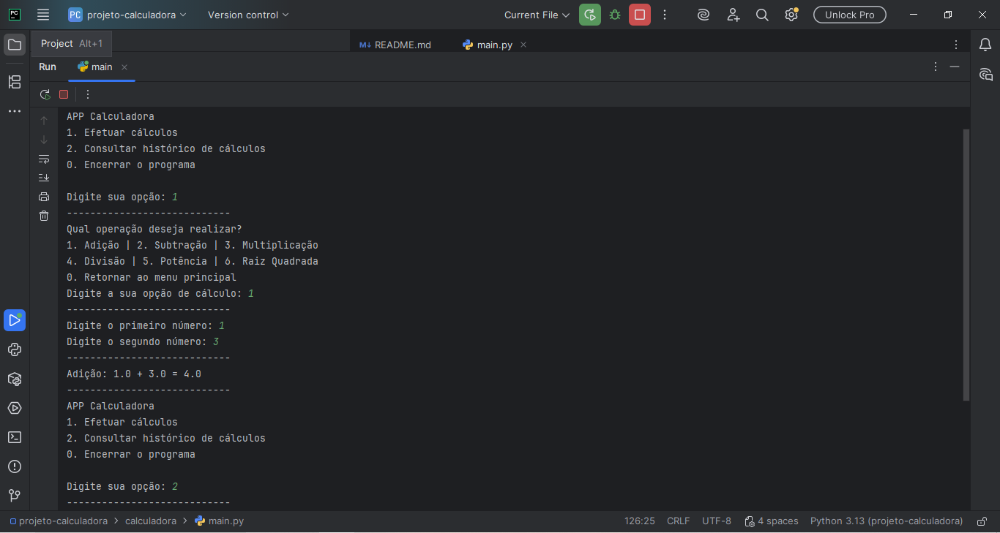

# Calculadora Procedural em Python - Estudo de Paradigmas
__________________________________________________________

## Introdução
_________________________________________________________
Este projeto demonstra a implementação de uma aplicação de calculadora simples utilizando o paradigma procedural em Python, com foco em separação de responsabilidade, tratamento estruturado de exceções e organização funcional do fluxo de execução.

O objetivo é comparar decisões de paradigmas entre abordagens procedural (Python) e orientada a objetos (Java), evidenciando impactos em estrutura, complexidade e escalabilidade.

## Contexto
_________________________________________________________
O projeto é uma versão procedural da calculadora desenvolvida anteriormente em Java (POO).

O objetivo foi comparar abordagens estruturais diferentes para resolver o mesmo problema.

Foco em simplicidade estrutural, uso de funções e fluxo linear de execução

## Tecnologia(s) Utilizada(s)
_________________________________________________________
◾ Python (Versão 3.x)

◾ PyCharm

## Decisões Técnicas
_________________________________________________________
1. A aplicação possui escopo simples, sem múltiplas entidades ou estados complexos. O uso de classes nesse cenário poderia introduzir abstrações desnecessárias, aumentando complexidade estrutural sem ganho proporcional. A abordagem procedural foi escolhida por ser suficiente para o problema e manter o fluxo direto e legível; 
2. Cada operação matemática foi isolada em funções específicas, promovendo separação de responsabilidades e evitando repetição de código. O fluxo principal atua apenas como orquestrador da execução; 
3. As funções responsáveis pelos cálculos realizam a validação de regras de negócio e lançam exceções quando necessário (ex: divisão por zero ou raiz quadrada de número negativo). O tratamento das exceções é centralizado no fluxo principal, mantendo clara separação entre lógica e interação com o usuário;
4. Aplicação do princípio KISS (Keep It Simple, Stupid);
5. Evita overengineering;
6. Em casos que a calculadora poderia evoluir para abranger outros tipos de cálculo, como cálculos geométricos, algébricos, entre outros, seria interessante verificar a possibilidade de migração para o paradigma Orientado a Objetos, para melhor separação e, talvez, aplicação dos pilares do POO.

## Diferenças em relação à versão Java
_________________________________________________________
◾ Não utiliza classes

◾ Estrutura baseada em funções

◾ Organização linear

◾ Menor nível de abstração

◾ Código mais enxuto

## Reflexão Arquitetural
_________________________________________________________
Para aplicações pequenas e bem definidas, o paradigma procedural atende de forma eficiente.

Contudo, em cenários que envolvam crescimento do sistema, múltiplas responsabilidades ou necessidade de extensibilidade, a abordagem orientada a objetos tende a oferecer melhor organização e manutenção.

## Tratamento de exceções
_________________________________________________________
As funções responsáveis pelas operações não tratam as exceções internamente, apenas validam regras de negócio e lançam erros quando necessário.

O tratamento é centralizado no fluxo principal, o que garante: melhor testabilidade, separação entre regra de negócio e interface do usuário, redução de acoplamento e clareza de fluxo de erro.

## Limitações
_________________________________________________________
◾ Não possui persistência em Banco de Dados

◾ Histórico armazenado somente durante a execução do programa

◾ Interface apenas via terminal

◾ Não há suítes de testes automatizados

## Como executar
_________________________________________________________
1. Certifique de ter o Python 3.x instalado
2. Clone o repositório
3. Abra a pasta do projeto
4. Execute o arquivo com o comando: 'python nome_do_arquivo.py' (substitua o nome_do_arquivo pelo nome real)

Observação: a execução também pode ser feita através em uma IDE Python (Ex: PyCharm)

## Próximos Passos
_________________________________________________________
1. Testes automatizados
2. Interface gráfica

3. Integração com Banco de Dados
